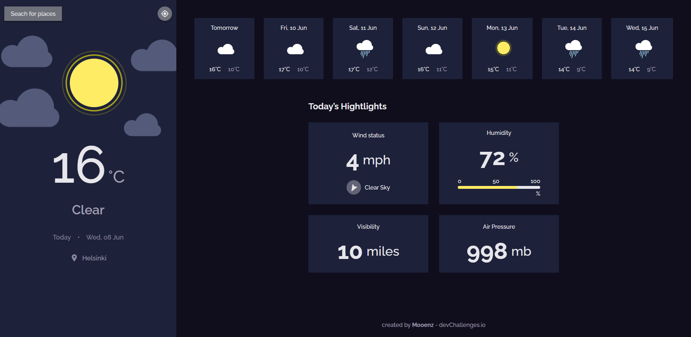
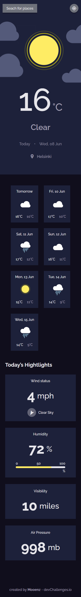

<h1 align="center">Weather app</h1>

<div align="center">
   Solution for a challenge from  <a href="http://devchallenges.io" target="_blank">Devchallenges.io</a>.
</div>

<div align="center">
  <h3>
    <a href="https://mooenz.github.io/weather-app-master/">
      Demo
    </a>
    <span> | </span>
    <a href="https://devchallenges.io/solutions/ERQzzMzXrxLzVm8oZs6H">
      Solution
    </a>
    <span> | </span>
    <a href="https://devchallenges.io/challenges/mM1UIenRhK808W8qmLWv">
      Challenge
    </a>
  </h3>
</div>

<!-- TABLE OF CONTENTS -->

## Table of Contents

- [Table of Contents](#table-of-contents)
- [Overview](#overview)
  - [Built With](#built-with)
- [Features](#features)
- [How To Use](#how-to-use)
- [Contact](#contact)

<!-- OVERVIEW -->

## Overview




### Built With

- [React](https://reactjs.org/)
- [Styled Components](https://styled-components.com/)
- [Api Weather](https://openweathermap.org/)

## Features

This application/site was created as a submission to a [DevChallenges](https://devchallenges.io/challenges) challenge. The [challenge](https://devchallenges.io/challenges/mM1UIenRhK808W8qmLWv) was to build an application to complete the given user stories.

## How To Use

<!-- Example: -->

To clone and run this application, you'll need [Git](https://git-scm.com) and [Node.js](https://nodejs.org/en/download/) (which comes with [npm](http://npmjs.com)) installed on your computer. From your command line:

```bash
# Clone this repository
$ git clone https://github.com/your-user-name/your-project-name

# Install dependencies
$ npm install

# Run the app
$ npm start
```

## Contact

- Website [mooenz.me](https://www.mooenz.me/)
- GitHub [@mooenz](https://github.com/Mooenz)
- Twitter [@mooenzdev](https://twitter.com/MooenzDev)
